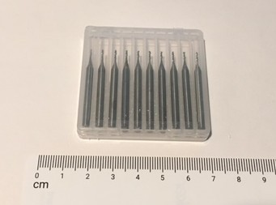
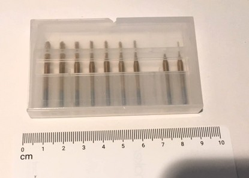
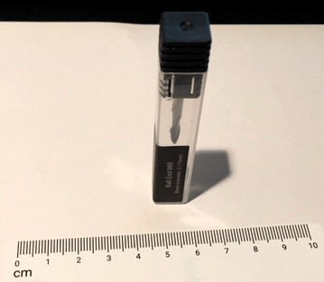
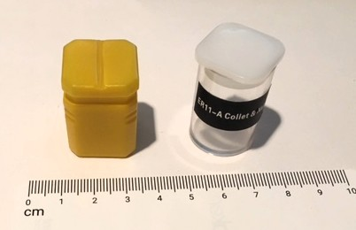
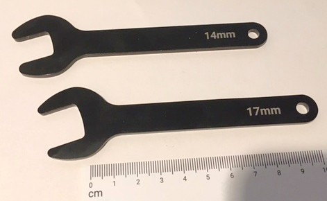
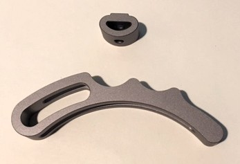

# snap_tools

A project to create tool holders for Snapmaker tools.

My Snapmaker A350 came with a number of small parts and tools. I started this project to create some trays to store the parts in an organized and visible way.  I considered cutting the trays out of scrap wood but realized that styrofoam blocks were easier to cut and lighter weight.

## Final Results

<!---
 

-->

  
  

## Process
- For simple tools and containers
  - Use [Inkscape](https://inkscape.org/) to draw a basic shape
  - Keep it simple - remember that each tool has multiple profiles and rectangles are easy to draw
  - Resize the outline (inset, outset) to account for router bit profiles

- For more complex tool shapes (see the holder outlines)
  - Trace the outline of the tools onto white paper
  - Color in the shape with a Sharpie marker to get a darker image
  - Scan the image to a PNG image
  - Import the image into Inkscape to create a vector diagram
    - Import PNG
    - Path | Bitmap to Path
    - Use path editing tools to clean up outline
    - Resize to create a tighter outline for cutting

- Use [Snapmaker Luban](https://snapmaker.com/product/snapmaker-2/downloads) to create the CNC router file
  - Open Luban and select CNC router
  - Add SVG element
  - Create two paths for an element
    - Fill path to clear center of element
    - Final path to route on line and create a smooth edge
  - Route the shapes into material to act as holders

## Materials
- Styrofoam
  - Recycled styrofoam from an discarded cooler
  - Light weight material that is fast and easy to cut

- Wood scraps
  - Small scraps of discarded pine
  - Works well but is heavier and harder to cut

## Part

- [Bit Box 10x55mm](https://github.com/dennisvandam/snap_tools/tree/main/tools/bit_box_10x55)
  - small box of router bits
  - rectangle slot for bit box to stand in
  - 

- [Bit Box 10x88mm](https://github.com/dennisvandam/snap_tools/tree/main/tools/bit_box_10x88)
  - small box of router bits 
  - rectangle slot for box to stand in
  - 

- [Bit Box 13x13x70mm](https://github.com/dennisvandam/snap_tools/tree/main/tools/bit_box_13x13x70)
  - single router bit box that comes with the Snapmaker 
  - square for box to stand in (13x13mm)
  - 

- [Collet Box](https://github.com/dennisvandam/snap_tools/tree/main/tools/collet_box)
  - collect box shapes including the one that came with Snapmaker (cylinder) and some square ones 
  - square for box to stand in (22x22mm)
  - 

- [Collet Wrench](https://github.com/dennisvandam/snap_tools/tree/main/tools/collet_wrench)
  - collect wrench that came with Snapmaker
  - rectangle slot for wrench to stand in
  - 

- [Head Wrench](https://github.com/dennisvandam/snap_tools/tree/main/tools/head_wrench)
  - Wrench that came with Snapmaker and used to change the head
  - Outline of wrench to hold in place
  - 

- [Hold Down](https://github.com/dennisvandam/snap_tools/tree/main/tools/hold_down)
  - Hold down and hold down nut used to secure materials to Snapmaker table
  - Includes outlines for face as well top (rectangle)
  - 
  -  

