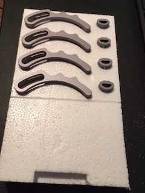
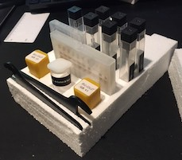

# snap_tools

A project to create tool holders for Snapmaker tools.

My Snapmaker A350 came with a number of small parts and tools. I started this project to create some trays to store the parts in an organized and visible way.  I considered cutting the trays out of scrap wood but realized that styrofoam blocks were very easy to cut and lighter weight.

## Final Pics

## Process for creating tool outlines
- For simple tools and containers
  - Use Inkscape to draw a basic shape
  - Keeps it simple - remember that each tool has multiple profiles and rectangles are easy to draw
  - Resize (inset, outset) to account for router bit profiles

- For more detailed tool shapes (see the holder outlines)
  - Trace the outline of tools onto white paper
  - Color in the shape with a Sharpie marker to get a darker image
  - Scan the impage to a PNG image
  - Import into Inkscape to create a vector diagram
    - Import PNG
    - Path | Bitmap to Path
    - Use path editing tools to clean up outline
    - Resize to create a tighter outline for cutting

- Use Luban to create CNC routing
  - CNC router
  - Load SVG
  - Route the shapes into material to act as holders

## Materials
- Styrofoam
  - Recycled styrofoam from an discarded cooler worked great
  - Fast, easy cutting
  - Light weight

- Wood scraps
  - I cut some pieces out of small scraps of pine
  - This worked well but was heavier and took longer to cut

## Files
- Scanned tools
  - CNC routing hold downs and nuts

- Simple shapes
  - Snapmaker head changing tool
  - Snapmaker collet wrenches
    - square slots
  - Snapmaker square bit boxes
    - 13x13mm (upright)
    - 13x70mm (flat)
